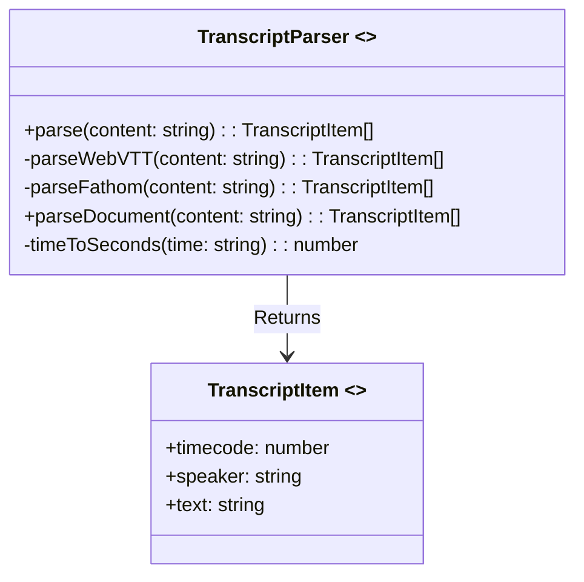
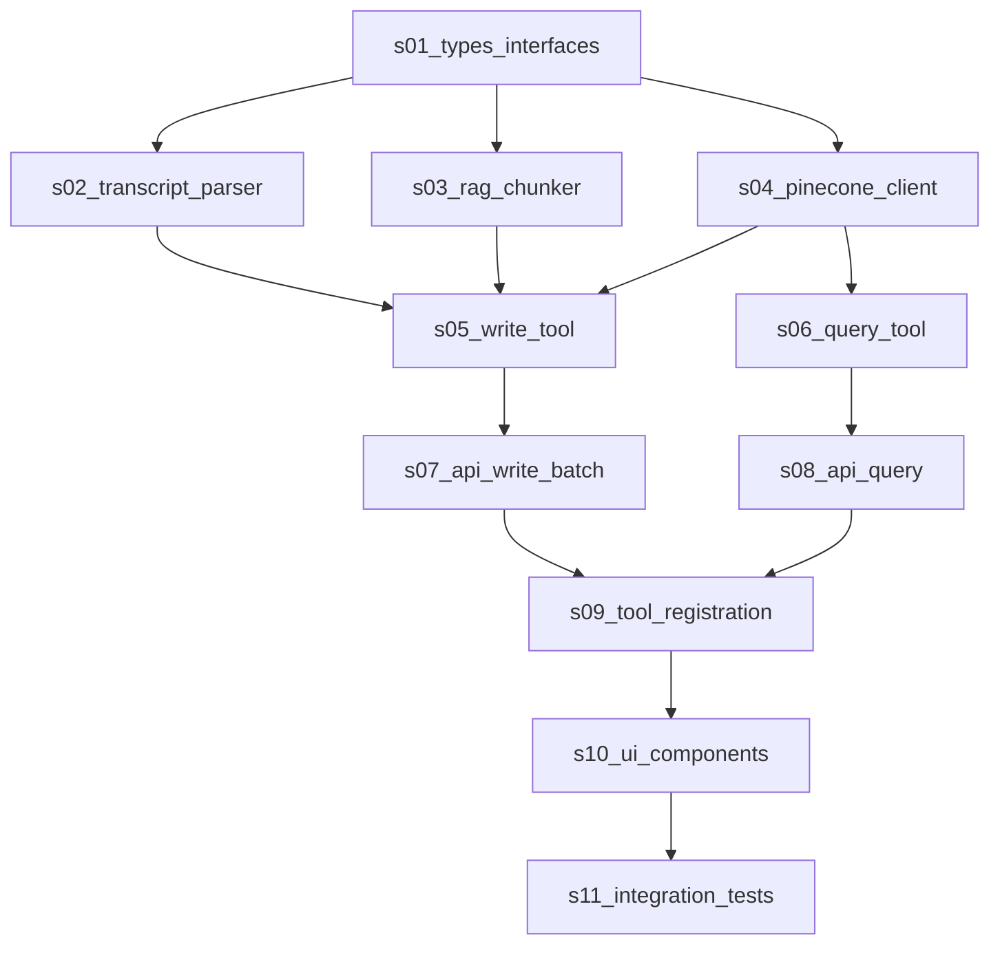

# Sprint Task Generator

Generate atomic units of work from the architecture specification:  $ARGUMENTS


## Workflow

This command follows a structured process to decompose architecture specs into sprint-ready tasks:

### Phase 1: Specification Analysis
1. **Load Specification**: Read the target architecture spec
2. **Identify Components**: Extract all components, APIs, and data layers
3. **Map Dependencies**: Build dependency graph between components
4. **Determine Order**: Create implementation sequence based on dependencies

### Phase 2: Task Generation
1. **Create Atomic Tasks**: Break down into smallest implementable units
2. **Assign Dependencies**: Link tasks that must complete before others
3. **Add Technical Details**: Include specific implementation steps
4. **Generate Checklists**: Create verification steps for each task
5. **Get Approval**: List out your prposed task list and ask User to review and approve.  Make any changes requested.

### Phase 3: Sprint Organization
1. **Create Directory Structure**: `specs/<spec_name>/issues/`
2. **Generate Task Files**: `s[XX]_<subtask_name>.md`
3. **Create Index**: Generate overview with dependency graph

## Important Considerations for each Atomic Unit
- Each Atomic Subtask is responsible for its own unit Testing!! Your subtask definition MUST include 


## Implementation Prompts

### For Specification Analysis:
```
Analyze this architecture specification and identify:
1. All components to be implemented (server/client)
2. Data access layer requirements
3. Type definitions needed
4. API routes required
5. UI components and their hierarchy
6. External dependencies
Create a dependency graph showing implementation order.
```

### For Task Decomposition:
```
For each component identified, create an atomic task that:
1. Can be completed in 1-4 hours
2. Has clear success criteria
3. Can be tested independently
4. Has minimal dependencies

Order tasks by:
1. Foundation first (types, interfaces)
2. Data layer
3. Server components
4. Client components
5. Integration points
```

### For Task File Generation:
```
Generate a subtask file following this exact structure:

# Subtask: [Specific, actionable title]

**Issue:** [Parent issue name from spec]
**Milestone:** m01-implementation
**Status:** To Do
**Depends On:** [List prerequisite task IDs]

## 1. Goal
[One sentence describing what this task accomplishes]

## 2. File Tree & Affected Files
[Show exact file paths to create/modify]

## 3. Key Data Points / Interface
[Table of props, types, methods relevant to this task]

## 4. Visual Reference / Layout
[ASCII diagram or component layout if UI-related]

## 5. Component Hierarchy (Task Specific)
[Mermaid diagram showing this component's context]

## 6. Technical Implementation Details
[Step-by-step implementation instructions]

## 7. Unit Tests
[Table that lists:  Functionality, Test, Reason, Success Case, Edge Cases]

## 8. Notes / TODOs
[Edge cases, reminders, follow-ups]
```

## Example Execution

### Input: RAG Tools Specification
```
/create-sprint specs/rag-tools/01-core-implementation.md
```

### Output Structure:
```
specs/rag-tools/issues/
├── index.md                          # Sprint overview
├── s01_types_interfaces.md           # Type definitions
├── s02_transcript_parser.md          # Parser implementation
├── s03_rag_chunker.md                # Chunker logic
├── s04_pinecone_client.md            # Database client
├── s05_write_tool.md                 # Write tool
├── s06_query_tool.md                 # Query tool
├── s07_api_write_batch.md            # Write API route
├── s08_api_query.md                  # Query API route
├── s09_tool_registration.md          # Tool integration
├── s10_ui_components.md              # UI updates
└── s11_integration_tests.md          # End-to-end testing
```

### Sample Generated Task: `s02_transcript_parser.md`

````markdown
# Subtask: Implement Transcript Parser for WebVTT and Fathom Formats

**Issue:** rag-tools-core
**Milestone:** m01-implementation
**Status:** To Do
**Depends On:** s01_types_interfaces

## 1. Goal

To create a transcript parser that detects format (WebVTT/Fathom) and converts raw transcript text into structured TranscriptItem arrays.

## 2. File Tree & Affected Files

```
lib/
└── ai/
    └── utils/
        └── transcript-parser.ts   # << CREATE
__tests__/
└── unit/
    └── transcript-parser.test.ts  # << CREATE
```

*   **Create:** `lib/ai/utils/transcript-parser.ts`
*   **Create:** `__tests__/unit/transcript-parser.test.ts`
*   **Reference:** Type definitions from `s01_types_interfaces`

## 3. Key Data Points / Interface

| Category      | Item                 | Type/Value                              | Description                                  |
| :------------ | :------------------- | :-------------------------------------- | :------------------------------------------- |
| **Interface** | `TranscriptItem`     | `{ timecode: number, speaker: string, text: string }` | Parsed transcript item |
| **Method**    | `parse()`            | `(content: string) => TranscriptItem[]` | Main parsing method |
| **Method**    | `parseWebVTT()`      | `(content: string) => TranscriptItem[]` | WebVTT format parser |
| **Method**    | `parseFathom()`      | `(content: string) => TranscriptItem[]` | Fathom format parser |
| **Method**    | `parseDocument()`    | `(content: string) => TranscriptItem[]` | Document parser |
| **Method**    | `timeToSeconds()`    | `(time: string) => number`             | Time conversion utility |

## 4. Visual Reference / Layout

```
Input: WebVTT Format
--------------------
WEBVTT

1
00:00:03.840 --> 00:00:08.200
Drew Beaupre: This is a test.

Output: TranscriptItem[]
------------------------
[
  {
    timecode: 3.84,
    speaker: "Drew Beaupre",
    text: "This is a test."
  }
]
```

## 5. Component Hierarchy (Task Specific)



## 6. Technical Implementation Details

### 6.1 Create Parser Class Structure
*   Create file `lib/ai/utils/transcript-parser.ts`
*   Define `TranscriptItem` interface
*   Create `TranscriptParser` class with static methods

### 6.2 Implement Format Detection
*   In `parse()` method, check for "WEBVTT" to detect WebVTT format
*   Check for "VIEW RECORDING" to detect Fathom format
*   Throw error for unsupported formats

### 6.3 Implement WebVTT Parser
*   Split content by double newlines
*   Filter blocks containing "-->"
*   Extract timestamp using regex
*   Parse speaker and text from last line
*   Convert timestamp to seconds

### 6.4 Implement Fathom Parser
*   Split content by newlines
*   Match pattern: `^\d+:\d+\s*-\s*([^(]+)`
*   Extract speaker name
*   Get text from next non-empty line
*   Convert time to seconds

### 6.5 Implement Document Parser
*   Split by markdown headers (`^#{1,3}\s+`)
*   Use index as pseudo-timecode
*   Set speaker as "document"
*   Trim section text

### 6.6 Create Unit Tests
*   Test format detection for both valid formats
*   Test error on unsupported format
*   Test timestamp parsing accuracy
*   Test speaker extraction
*   Test edge cases (empty blocks, malformed data)

## 7. Unit Tests
.... table
## Task Dependency Management

### Dependency Types:
1. **Type Dependencies**: Tasks requiring type definitions
2. **Data Dependencies**: Tasks needing data layer
3. **Component Dependencies**: UI components needing parents
4. **Integration Dependencies**: Tasks requiring multiple components

### Dependency Graph Example:


## Best Practices

### Task Sizing:
- Each task should be completable in 4-8 hours
- Complex components split into multiple tasks
- Database operations separate from business logic

### Naming Convention:
- `s[XX]_descriptive_name.md`
- Numbers padded with zeros (s01, s02, etc.)
- Lowercase with underscores
- Descriptive but concise

### Verification Steps:
- Always include type checking
- Unit tests for logic-heavy tasks
- Build verification for all tasks
- Manual testing only when UI involved

### Documentation:
- Every task self-contained
- No assumed knowledge beyond dependencies
- Clear success criteria
- Explicit file paths

## Arguments

The command accepts a path to a specification file:
- Relative paths resolved from project root
- Must be markdown file with clear architecture sections
- Should include component definitions and relationships

